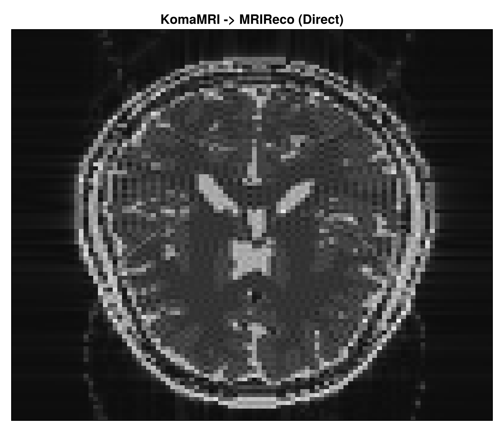
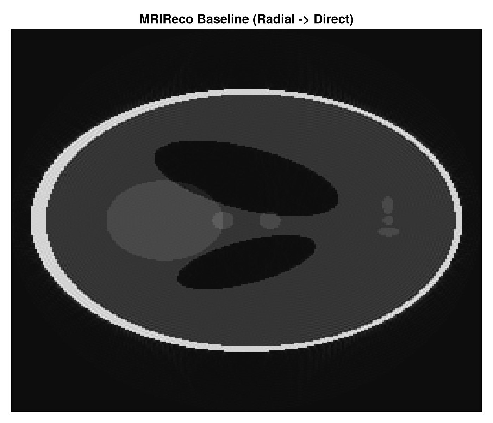

# End-to-End MRI Workflow

This page documents the runnable MRI workflow in [src/workflows/mri_simulation](https://github.com/JuliaHealth/JuliaHealthZoo/tree/main/src/workflows/mri_simulation).
It is generated from the documentation source in [docs/make.jl](https://github.com/JuliaHealth/JuliaHealthZoo/blob/main/docs/make.jl) and published by the docs CI in [`.github/workflows/docs.yml`](https://github.com/JuliaHealth/JuliaHealthZoo/blob/main/.github/workflows/docs.yml).

This page presents the runnable code path, explains each file, and links the documentation directly to the implementation.

## What the workflow does

The runnable pipeline is:

1. Simulate MRI data with KomaMRI.jl.
2. Reconstruct the simulated raw data with MRIReco.jl.
3. Run a minimal BART example through BartIO.jl.

This workflow stops at BART on purpose. PythonCall is documented separately in [Interoperability (PythonCall/C++)](mri-interop.md).

## Source map

| Step | File | Purpose |
| --- | --- | --- |
| Orchestration | [run.jl](https://github.com/JuliaHealth/JuliaHealthZoo/blob/main/src/workflows/mri_simulation/run.jl) | Reads config, sets shared constants, runs each step |
| Step 1 | [01_simulate_komamri.jl](https://github.com/JuliaHealth/JuliaHealthZoo/blob/main/src/workflows/mri_simulation/src/01_simulate_komamri.jl) | Generates synthetic raw MRI data |
| Step 2 | [02_komamri_to_mrireco.jl](https://github.com/JuliaHealth/JuliaHealthZoo/blob/main/src/workflows/mri_simulation/src/02_komamri_to_mrireco.jl) | Reconstructs the simulated raw data |
| Step 3 | [03_bartio_bart.jl](https://github.com/JuliaHealth/JuliaHealthZoo/blob/main/src/workflows/mri_simulation/src/03_bartio_bart.jl) | Calls BART from Julia through BartIO |
| Config example | [config.toml.example](https://github.com/JuliaHealth/JuliaHealthZoo/blob/main/src/workflows/mri_simulation/config.toml.example) | Shows the supported local settings |

## How page generation works

DocumenterVitepress turns these markdown pages into the website.
That means this page is not a separate handwritten summary; it is part of the docs source tree and gets rebuilt when the docs workflow runs.

The two CI pieces to know are:

- [`.github/workflows/docs.yml`](https://github.com/JuliaHealth/JuliaHealthZoo/blob/main/.github/workflows/docs.yml) builds and deploys the website.
- [`.github/workflows/CI.yml`](https://github.com/JuliaHealth/JuliaHealthZoo/blob/main/.github/workflows/CI.yml) runs the workflow itself so failures show up as CI failures, not just as documentation changes.

This keeps the documentation tied to the repository and makes workflow failures visible in CI.

## Orchestrator

The runner in [run.jl](https://github.com/JuliaHealth/JuliaHealthZoo/blob/main/src/workflows/mri_simulation/run.jl) is intentionally small.
It reads configuration, creates the output directory, and includes each step in order.

The code below is the entry point for the workflow. It shows how shared settings are loaded once, then reused by each included step script.

```julia
config = TOML.parsefile(config_file)

const OUTPUT_DIR = joinpath(@__DIR__, config["output"]["dir"])
const KOMA_GPU = config["koma"]["gpu"]
const BART_ENABLED = get(get(config, "bart", Dict{String, Any}()), "enabled", false)
const BART_PATH = get(get(config, "bart", Dict{String, Any}()), "bart_path", "")

steps = [
    ("KomaMRI simulation", joinpath("src", "01_simulate_komamri.jl")),
    ("KomaMRI to MRIReco", joinpath("src", "02_komamri_to_mrireco.jl")),
    ("BART via BartIO", joinpath("src", "03_bartio_bart.jl")),
]
```

What this means in practice:

- `OUTPUT_DIR` is where every result file is written.
- `KOMA_GPU` controls whether simulation runs on CPU or GPU.
- `BART_ENABLED` and `BART_PATH` keep BART optional.
- The `steps` list makes the workflow easy to read and easy to extend.

This pattern keeps orchestration separate from implementation. Each step file remains focused on one task, while the runner only handles control flow and configuration.

## Step 1: KomaMRI simulation

The simulation step is in [01_simulate_komamri.jl](https://github.com/JuliaHealth/JuliaHealthZoo/blob/main/src/workflows/mri_simulation/src/01_simulate_komamri.jl).
It loads a built-in phantom, reads an example EPI sequence, simulates the acquisition, and stores the raw output.

This section uses KomaMRI to generate synthetic MRI data from a built-in phantom and an example sequence. The output of this step becomes the input to MRIReco in the next stage.

```julia
scanner = Scanner()
phantom = brain_phantom2D()

seq_path = joinpath(
    dirname(pathof(KomaMRI)),
    "../examples/5.koma_paper/comparison_accuracy/sequences/EPI/epi_100x100_TE100_FOV230.seq",
)
sequence = read_seq(seq_path)

sim_params = KomaMRICore.default_sim_params()
sim_params["gpu"] = KOMA_GPU
raw_signal = simulate(phantom, sequence, scanner; sim_params = sim_params)
```

The snippet creates the scanner and phantom, loads the sequence file from the package examples, applies simulation settings, and runs the acquisition simulation.

What each part does:

- `Scanner()` creates the scanner/system model.
- `brain_phantom2D()` gives a built-in synthetic anatomy.
- `read_seq(...)` loads the example EPI sequence.
- `default_sim_params()` starts from KomaMRI defaults.
- `sim_params["gpu"] = KOMA_GPU` keeps the CPU/GPU choice in config.
- `simulate(...)` produces the raw data that the next step reconstructs.

The step writes the raw binary output and a small text summary so the acquisition can be checked without opening the binary file.

The step then writes two files:

- `output/komamri_raw.bin`
- `output/komamri_raw_summary.txt`

The summary records the trajectory type, reconstruction size, encoded size, and number of profiles so the output can be checked quickly.

## Step 2: MRIReco reconstruction

The reconstruction step is in [02_komamri_to_mrireco.jl](https://github.com/JuliaHealth/JuliaHealthZoo/blob/main/src/workflows/mri_simulation/src/02_komamri_to_mrireco.jl).
It reads the serialized raw data, wraps it in MRIReco’s acquisition container, and runs a direct reconstruction.

This step shows the Julia-native reconstruction path. The saved raw acquisition from KomaMRI is deserialized, converted into MRIReco’s input type, and reconstructed with a direct solver.

```julia
raw_path = joinpath(OUTPUT_DIR, "komamri_raw.bin")
if !isfile(raw_path)
    error("Missing input raw data: output/komamri_raw.bin. Run Step 1 first.")
end

raw_signal = deserialize(raw_path)

acquisition_data = AcquisitionData(raw_signal)
if !isempty(acquisition_data.traj)
    acquisition_data.traj[1].circular = false
end

recon_width, recon_height = raw_signal.params["reconSize"][1:2]
recon_options = Dict{Symbol, Any}(
    :reco => "direct",
    :reconSize => (recon_width, recon_height),
)

reconstructed_image = reconstruction(acquisition_data, recon_options)
```

The code first checks that the raw file exists, then reconstructs the image using the size stored in the simulation metadata. That keeps the reconstruction aligned with the simulated acquisition.

What this does:

- `deserialize(raw_path)` reloads the simulated raw acquisition.
- `AcquisitionData(raw_signal)` converts the raw data into MRIReco’s input type.
- The trajectory adjustment keeps the reconstruction path explicit.
- `recon_options` tells MRIReco to use direct reconstruction and the target image size.
- `reconstruction(...)` returns the reconstructed image.

The output is saved both as a binary file and as a short summary file. The summary is enough to verify dimensions and reconstruction size at a glance.

This step writes:

- `output/mrireco_reconstruction.bin`
- `output/mrireco_reconstruction_summary.txt`

The summary stores the reconstruction size, number of dimensions, and final array shape.

### MRIReco context

MRIReco is the Julia-native reconstruction layer in this workflow.
It is designed for modular reconstruction experiments and can be extended toward more advanced methods such as compressed sensing and ADMM-based solvers.
That is why it is the natural Julia-side reconstruction checkpoint before comparing against BART.

The next step uses BART to provide a command-line reconstruction comparison through BartIO.

## Step 3: BART via BartIO

The BART step is in [03_bartio_bart.jl](https://github.com/JuliaHealth/JuliaHealthZoo/blob/main/src/workflows/mri_simulation/src/03_bartio_bart.jl).
It is optional, controlled by the config file, and runs only when BART is installed locally.

This section demonstrates how Julia can orchestrate an external reconstruction tool while keeping the workflow in one place.

```julia
if !BART_ENABLED
    println("BART step skipped (bart.enabled = false in config.toml).")
else
    if isempty(BART_PATH)
        error("bart.enabled=true but bart_path is empty in config.toml")
    end

    using BartIO

    set_bart_path(BART_PATH)
    bart(0, "version")

    kspace_trajectory = bart(1, "traj -x 128 -y 256 -r")
    bart_kspace = bart(1, "phantom -k -t", kspace_trajectory)
    bart_reconstruction = bart(1, "nufft -i", kspace_trajectory, bart_kspace)
end
```

The code first checks whether the BART step is enabled, then sets the BART executable path, validates the installation, and runs a minimal phantom-to-reconstruction pipeline.

What this does:

- `set_bart_path(BART_PATH)` tells BartIO where the BART executable lives.
- `bart(0, "version")` checks that BART is reachable.
- `bart(1, "traj -x 128 -y 256 -r")` creates a trajectory.
- `bart(1, "phantom -k -t", ...)` generates k-space phantom data.
- `bart(1, "nufft -i", ...)` performs the reconstruction.

The result is written to BART’s `.cfl/.hdr` format and read back once to confirm the round-trip works. That makes the data exchange explicit and reproducible.

The step then writes and reads back `.cfl/.hdr` files:

- `output/bart_kspace.(cfl/hdr)`
- `output/bart_reconstruction.(cfl/hdr)`
- `output/bartio_summary.txt`

That round-trip matters because it shows the workflow can move BART data through Julia explicitly and reproducibly.

## Configuration

The local config example is [config.toml.example](https://github.com/JuliaHealth/JuliaHealthZoo/blob/main/src/workflows/mri_simulation/config.toml.example).
It keeps BART off by default so the workflow runs on machines that do not have BART installed.

The example config is the file users copy locally before running the workflow.

```toml
[output]
dir = "output"

[koma]
gpu = false

[bart]
enabled = false
bart_path = ""
```

The values are intentionally minimal: a local output directory, CPU simulation by default, and BART disabled unless the user explicitly enables it.

To enable BART locally, set:

- `bart.enabled = true`
- `bart.bart_path = "/path/to/bart"`

## Outputs you should expect

After a successful run, the workflow produces:

These files are the main run artifacts. They cover the simulated raw data, the reconstructed image, and the BART outputs.

- `output/komamri_raw.bin`
- `output/komamri_raw_summary.txt`
- `output/mrireco_reconstruction.bin`
- `output/mrireco_reconstruction_summary.txt`
- `output/bart_kspace.cfl`
- `output/bart_kspace.hdr`
- `output/bart_reconstruction.cfl`
- `output/bart_reconstruction.hdr`
- `output/bartio_summary.txt`

## What the outputs look like

These are the kinds of summaries you should see after a successful local run:

Each summary file is short by design. It gives a quick check that the workflow ran with the expected sizes and output structure.

```text
KomaMRI raw-data summary
trajectory=other
recon_size=[100, 100, 1]
encoded_size=[100, 100, 1]
num_profiles=100
```

```text
MRIReco reconstruction summary
recon_size=(100, 100)
image_ndims=6
image_size=(100, 100, 1, 1, 1, 1)
```

```text
BartIO/BART summary
kspace_size=(1, 128, 256)
reconstruction_size=(128, 128)
```

The workflow also writes PNG reconstructions locally in the output folder:

The images below are copies of the workflow outputs, placed in the docs tree so they can render directly on the page.




