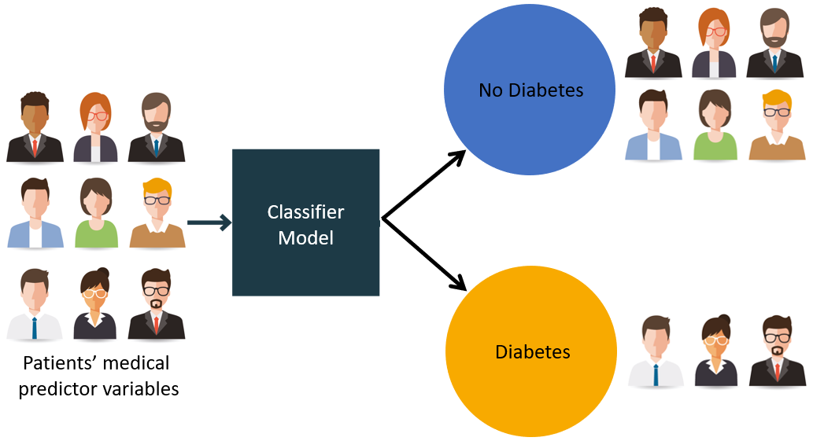

# Feature Engineering and Preprocessing

## Overview

With the target and outcome cohorts populated in the database, the next step is to give each patient a numerical fingerprint - a row of features that summarises their clinical history in the 365 days before their index date.

This single constraint governs every query on this page: **everything used to predict must come from before the index date.** Any future information would constitute data leakage and make the model useless in practice.

## Feature Sources

Features are drawn from six OMOP CDM tables, each capturing a different dimension of a patient's clinical picture.

| OMOP Table | Features Extracted |
|------------|-------------------|
| `person` | Age at index date, sex, race, ethnicity |
| `condition_occurrence` | Count of distinct diagnoses |
| `drug_exposure` | Distinct drugs, total days of supply, total quantity, most common route |
| `procedure_occurrence` | Count of distinct procedures |
| `measurement` | Maximum recorded measurement value, most common unit |
| `observation` | Count of distinct observations, maximum observation value |

All queries share the same lookback pattern:

```sql
AND table.start_date BETWEEN cohort.cohort_start_date - INTERVAL 365 DAY
                         AND cohort.cohort_start_date
```

## Extracting Features

The code below connects to the DuckDB database and extracts one feature table per OMOP domain. All queries filter to `cohort_definition_id = 1` (the target cohort) and apply the 365-day lookback window.

```julia
using DuckDB, DBInterface, DataFrames

# conn, SCHEMA, TARGET_COHORT_ID are established by run.jl and shared with all sub-scripts
const conn   = DBInterface.connect(DuckDB.DB, config["database"]["path"])
const SCHEMA = config["schema"]["name"]
const COHORT = "cohort"
const TARGET = config["cohorts"]["target_cohort_id"]  # 1 = hypertension
const WINDOW = 365    # lookback days
```

### Demographics

Demographic features come from the `person` table without a lookback filter - a patient's age, sex, race, and ethnicity at their index date are static characteristics.

```julia
demographics_df = DataFrame(DBInterface.execute(conn, """
    SELECT
        c.subject_id,
        YEAR(c.cohort_start_date) - p.year_of_birth AS age,
        p.gender_concept_id,
        p.race_concept_id,
        p.ethnicity_concept_id
    FROM $SCHEMA.$COHORT c
    JOIN $SCHEMA.person p ON c.subject_id = p.person_id
    WHERE c.cohort_definition_id = $TARGET
"""))
```

### Conditions

The `concept_ancestor` join expands each specific diagnosis to its SNOMED ancestors, so the count captures both the precise diagnosis and its broader categories.

```julia
conditions_df = DataFrame(DBInterface.execute(conn, """
    SELECT
        c.subject_id,
        COUNT(DISTINCT ca.ancestor_concept_id) AS condition_count
    FROM $SCHEMA.$COHORT c
    JOIN $SCHEMA.condition_occurrence co ON c.subject_id = co.person_id
    JOIN $SCHEMA.concept_ancestor ca     ON co.condition_concept_id = ca.descendant_concept_id
    WHERE c.cohort_definition_id = $TARGET
      AND co.condition_start_date
          BETWEEN c.cohort_start_date - INTERVAL $WINDOW DAY
              AND c.cohort_start_date
    GROUP BY c.subject_id
"""))
```

### Drug Exposure

The `concept_ancestor` join rolls up specific drug ingredients to their RxNorm drug class ancestors, capturing both fine-grained and generalised medication exposure.

```julia
drugs_df = DataFrame(DBInterface.execute(conn, """
    SELECT
        c.subject_id,
        COUNT(DISTINCT ca.ancestor_concept_id) AS drug_count,
        SUM(de.days_supply)                    AS total_days_supply,
        SUM(de.quantity)                       AS total_quantity,
        MAX(de.route_concept_id)               AS max_common_route
    FROM $SCHEMA.$COHORT c
    JOIN $SCHEMA.drug_exposure de   ON c.subject_id = de.person_id
    JOIN $SCHEMA.concept_ancestor ca ON de.drug_concept_id = ca.descendant_concept_id
    WHERE c.cohort_definition_id = $TARGET
      AND de.drug_exposure_start_date
          BETWEEN c.cohort_start_date - INTERVAL $WINDOW DAY
              AND c.cohort_start_date
    GROUP BY c.subject_id
"""))
```

### Measurements

Measurements capture lab values and vitals. For each patient we take the maximum recorded value and most common unit within the lookback window.

```julia
measurements_df = DataFrame(DBInterface.execute(conn, """
    SELECT
        c.subject_id,
        MAX(m.value_as_number) AS max_measurement_value,
        MAX(m.unit_concept_id) AS max_common_unit
    FROM $SCHEMA.$COHORT c
    JOIN $SCHEMA.measurement m       ON c.subject_id = m.person_id
    JOIN $SCHEMA.concept_ancestor ca ON m.measurement_concept_id = ca.descendant_concept_id
    WHERE c.cohort_definition_id = $TARGET
      AND m.measurement_date
          BETWEEN c.cohort_start_date - INTERVAL $WINDOW DAY
              AND c.cohort_start_date
    GROUP BY c.subject_id
"""))
```

### Procedures

```julia
procedures_df = DataFrame(DBInterface.execute(conn, """
    SELECT
        c.subject_id,
        COUNT(DISTINCT ca.ancestor_concept_id) AS procedure_count
    FROM $SCHEMA.$COHORT c
    JOIN $SCHEMA.procedure_occurrence po ON c.subject_id = po.person_id
    JOIN $SCHEMA.concept_ancestor ca     ON po.procedure_concept_id = ca.descendant_concept_id
    WHERE c.cohort_definition_id = $TARGET
      AND po.procedure_date
          BETWEEN c.cohort_start_date - INTERVAL $WINDOW DAY
              AND c.cohort_start_date
    GROUP BY c.subject_id
"""))
```

### Observations

```julia
observations_df = DataFrame(DBInterface.execute(conn, """
    SELECT
        c.subject_id,
        COUNT(DISTINCT ob.observation_concept_id) AS observation_count,
        MAX(ob.value_as_number)                   AS max_observation_value
    FROM $SCHEMA.$COHORT c
    JOIN $SCHEMA.observation ob ON c.subject_id = ob.person_id
    WHERE c.cohort_definition_id = $TARGET
      AND ob.observation_date
          BETWEEN c.cohort_start_date - INTERVAL $WINDOW DAY
              AND c.cohort_start_date
    GROUP BY c.subject_id
"""))
```

## Distribution Check

Before attaching labels and preprocessing, it is worth inspecting the feature distributions to catch obvious data quality problems - all-zero columns, implausibly extreme values or skewed distributions.

## Attaching Outcome Labels

Each patient receives a binary label: `1` if they appear in the outcome cohort (pneumonia within 365 days of their index date), `0` otherwise. The join is deliberately simple - presence in `cohort_definition_id = 2` is the only criterion.

```julia
outcome_df = DataFrame(DBInterface.execute(conn, """
    SELECT subject_id, 1 AS outcome
    FROM $SCHEMA.$COHORT
    WHERE cohort_definition_id = 2
"""))

# Left join - patients not in the outcome cohort receive `missing`, replaced with 0
df = leftjoin(features_df, outcome_df; on = :subject_id)
df[!, :outcome] .= coalesce.(df[!, :outcome], 0)

DBInterface.close!(conn)
```



The resulting dataset has one row per patient:

| Column | Type | Meaning |
|--------|------|---------|
| `subject_id` | Int | Patient identifier |
| `age` | Float | Age at cohort entry |
| `gender_concept_id` | Int | Sex (OMOP concept ID) |
| `race_concept_id` | Int | Race (OMOP concept ID) |
| `ethnicity_concept_id` | Int | Ethnicity (OMOP concept ID) |
| `condition_count` | Int | Distinct diagnoses in lookback window |
| `drug_count` | Int | Distinct drug classes in lookback window |
| `total_days_supply` | Int | Total medication days supplied |
| `max_measurement_value` | Float | Highest lab/vital value recorded |
| `procedure_count` | Int | Distinct procedures in lookback window |
| `observation_count` | Int | Distinct clinical observations |
| `outcome` | 0 / 1 | Did this patient develop pneumonia? |

## Save the Matrix

Save to CSV so preprocessing and modeling can be run independently without re-querying the database:

```julia
using CSV
CSV.write(joinpath(OUTPUT_DIR, "plp_features.csv"), df)
println("Saved $(nrow(df)) rows to plp_features.csv")
```

`OUTPUT_DIR` is defined in `run.jl` as `src/workflows/patient_level_prediction/output/` and is created automatically on first run.

## Preprocessing

The feature matrix needs three preparation steps before it is ready for modeling.

### 1. Drop Low-Signal Columns

The distribution check may reveal columns that add noise rather than signal. In practice, `total_quantity` and `max_observation_value` are often very sparse or unreliable in synthetic data and are dropped here:

```julia
using InvertedIndices: Not
select!(df, Not([:total_quantity, :max_observation_value]))
```

### 2. Impute Missing Values

Patients with no records in a given OMOP domain have `missing` for that domain's features. Replace numeric gaps with `0` ("no events recorded") and categorical gaps with `"unknown"`:

```julia
for col in names(df)
    if eltype(df[!, col]) <: Union{Missing, Number}
        df[!, col] = coalesce.(df[!, col], 0)
    else
        df[!, col] = coalesce.(df[!, col], "unknown")
    end
end
```

### 3. Standardize Numeric Features

Logistic regression is sensitive to feature scale; large-magnitude features dominate the gradient. Standardize each numeric column to zero mean and unit variance:

```julia
using Statistics

num_features = [
    :age, :condition_count, :drug_count, :total_days_supply,
    :max_measurement_value, :max_common_route, :procedure_count, :observation_count,
]

for col in num_features
        col_std = std(skipmissing(df[!, col]))
        if col_std != 0
            df[!, col] .= (df[!, col] .- mean(skipmissing(df[!, col]))) ./ col_std
        end
    end
```

### 4. Encode Categorical Variables

OMOP stores sex, race, and ethnicity as integer concept IDs. Converting them to `CategoricalArray` tells MLJ.jl to treat them as unordered categories rather than ordinal numbers:

```julia
using CategoricalArrays

df.gender_concept_id    = categorical(coalesce.(df.gender_concept_id,    "unknown"))
df.race_concept_id      = categorical(coalesce.(df.race_concept_id,      "unknown"))
df.ethnicity_concept_id = categorical(coalesce.(df.ethnicity_concept_id, "unknown"))
```

