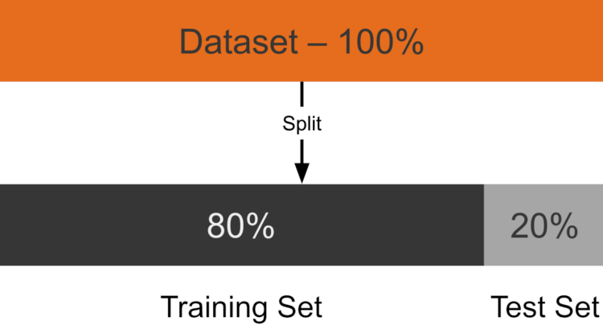
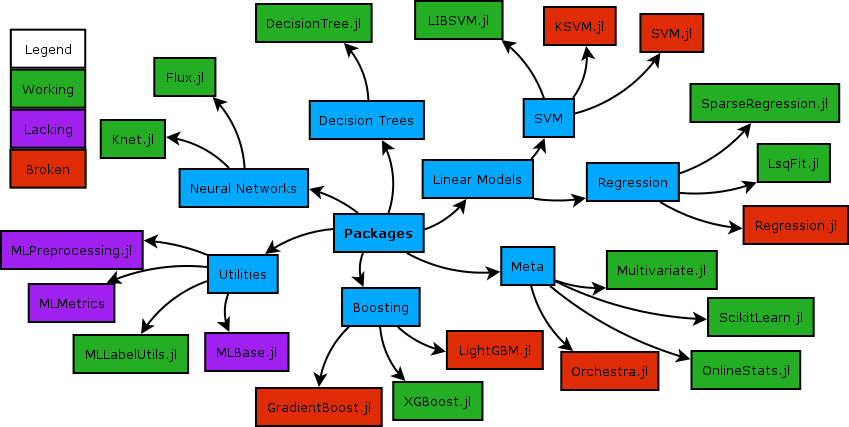

# Training and Evaluation

With the feature matrix built and preprocessed, this page covers the final step of the pipeline: splitting the data, training three classification models, and comparing their predictive performance with AUC.

## Load Preprocessed Data

The preprocessing step saved the final training and test splits to CSV. Load them here:

```julia
using CSV, DataFrames
using CategoricalArrays: categorical
using MLJ

train_df = CSV.read(joinpath("output", "train.csv"), DataFrame)
test_df  = CSV.read(joinpath("output", "test.csv"),  DataFrame)

# MLJ classifiers require a CategoricalVector of strings for the target
train_df.outcome = categorical(string.(train_df.outcome); levels = ["0", "1"])
test_df.outcome  = categorical(string.(test_df.outcome);  levels = ["0", "1"])

y_train = train_df.outcome
X_train = select(train_df, Not(:outcome))

y_test  = test_df.outcome
X_test  = select(test_df,  Not(:outcome))
```

The `levels = ["0", "1"]` call ensures both the train and test vectors share the same encoding - important for models that inspect the level order internally.

## Train-Test Split

The 80/20 split is performed during preprocessing (see `preprocessing.jl`) with a fixed random seed so the partition is reproducible:

```julia
# Done in preprocessing.jl:
# train, test = partition(df, 0.8; shuffle = true, rng = 42)
```



## Training Models with MLJ.jl

[MLJ.jl](https://alan-turing-institute.github.io/MLJ.jl/stable/) provides a uniform interface for every model family in Julia. The same `machine -> fit! -> predict` pattern works regardless of algorithm, making it straightforward to swap models or run comparisons.



Three models are trained and compared. The evaluation metric is **AUC** (Area Under the ROC Curve): 1.0 is a perfect classifier, 0.5 is random guessing.

```julia
using ROCAnalysis

function evaluate_model(model, X_train, y_train, X_test, y_test)
    mach = machine(model, X_train, y_train)
    fit!(mach; verbosity = 0)
    # pdf(..., "1") extracts the predicted probability of the positive class
    probs = pdf.(predict(mach, X_test), "1")
    score = auc(roc(probs, y_test .== "1"))
    return score, mach
end
```

### Logistic Regression with L1 Regularization

Logistic regression is the transparent baseline. L1 regularization (Lasso) drives the coefficients of irrelevant features exactly to zero, effectively selecting the most informative predictors and keeping the model interpretable.

See: [MLJLinearModels.jl documentation](https://juliaai.github.io/MLJLinearModels.jl/stable/)

```julia
using MLJLinearModels

logreg = MLJLinearModels.LogisticClassifier(penalty = :l1, lambda = 0.0428)
auc_lr, mach_lr = evaluate_model(logreg, X_train, y_train, X_test, y_test)
println("Logistic Regression  AUC: $auc_lr")
```

### Random Forest

Random forests build an ensemble of decision trees on random subsets of the training data and average their predictions. They handle non-linear relationships naturally, require minimal preprocessing, and are robust to correlated and noisy features.

See: [MLJDecisionTreeInterface.jl documentation](https://github.com/JuliaAI/MLJDecisionTreeInterface.jl)

```julia
using MLJDecisionTreeInterface

rf = MLJDecisionTreeInterface.RandomForestClassifier(n_trees = 100, max_depth = 10)
auc_rf, mach_rf = evaluate_model(rf, X_train, y_train, X_test, y_test)
println("Random Forest AUC: $auc_rf")
```

`n_trees = 100` provides a stable ensemble; `max_depth = 10` caps each tree's complexity to reduce overfitting.

### XGBoost

XGBoost (eXtreme Gradient Boosting) trains trees sequentially, with each tree correcting the residual errors of the previous one. It consistently delivers strong performance on structured tabular data and is often the best-performing algorithm in clinical prediction benchmarks.

See: [MLJXGBoostInterface.jl documentation](https://github.com/JuliaAI/MLJXGBoostInterface.jl)

```julia
using MLJXGBoostInterface

xgb = MLJXGBoostInterface.XGBoostClassifier(num_round = 100, max_depth = 5, eta = 0.1)
auc_xgb, mach_xgb = evaluate_model(xgb, X_train, y_train, X_test, y_test)
println("XGBoost AUC: $auc_xgb")
```

`eta = 0.1` is the learning rate - how much each tree corrects the model. Lower values generalise better but need more boosting rounds. `max_depth = 5` limits tree depth to control model complexity.

## Full Pipeline Summary

The complete PLP workflow from raw database to evaluated model:

| Step | Script | Key Package |
|------|--------|-------------|
| Study initialization | setup | `HealthBase.jl` |
| Cohort download | setup | `OHDSIAPI.jl` |
| Data exploration | `src/01_data_loader.jl` | `DuckDB.jl` + `PrettyTables.jl` |
| Cohort SQL translation & execution | `src/02_cohort_definition.jl` | `OHDSICohortExpressions.jl` + `FunSQL.jl` |
| Feature extraction | `src/03_feature_extraction.jl` | `DuckDB.jl` + `DataFrames.jl` |
| Distribution check | `src/04_distribution_check.jl` | `Statistics` |
| Outcome labeling | `src/05_outcome_attach.jl` | `DataFrames.jl` |
| Imputation, standardization, encoding | `src/06_preprocessing.jl` | `CategoricalArrays.jl` + `Statistics` |
| Train / test split | `src/06_preprocessing.jl` | `MLJ.jl` |
| Model training & evaluation | `src/07_train_model.jl` | `MLJLinearModels` · `MLJDecisionTreeInterface` · `MLJXGBoostInterface` |
| AUC scoring | `src/07_train_model.jl` | `ROCAnalysis.jl` |

The entire workflow is orchestrated by `run.jl`:

```julia
# run.jl
steps = [
    ("Defining cohorts",     joinpath("src", "02_cohort_definition.jl")),
    ("Extracting features",  joinpath("src", "03_feature_extraction.jl")),
    ("Checking distributions", joinpath("src", "04_distribution_check.jl")),
    ("Attaching outcomes",   joinpath("src", "05_outcome_attach.jl")),
    ("Preprocessing",        joinpath("src", "06_preprocessing.jl")),
    ("Training models",      joinpath("src", "07_train_model.jl")),
]

for (label, path) in steps
    println("\n── $label ────")
    include(path)
end
```

To reproduce the full pipeline:

```bash
julia --project=. run.jl
```

## References

- Reps, J. M., Schuemie, M. J., Suchard, M. A., Ryan, P. B., & Rijnbeek, P. R. (2018). Design and implementation of a standardized framework to generate and evaluate patient-level prediction models using observational healthcare data. *Journal of the American Medical Informatics Association*, 25(8), 969–975. https://doi.org/10.1093/jamia/ocy032
- [OHDSI Patient-Level Prediction](https://ohdsi.github.io/PatientLevelPrediction/)
- [OHDSI Common Data Model](https://ohdsi.github.io/CommonDataModel/)
- [ATLAS Demo Tool](https://atlas-demo.ohdsi.org/#/cohortdefinitions)
- [HealthBase.jl Documentation](https://juliahealth.org/HealthBase.jl/dev/)
- [JuliaHealth on GitHub](https://github.com/JuliaHealth)
